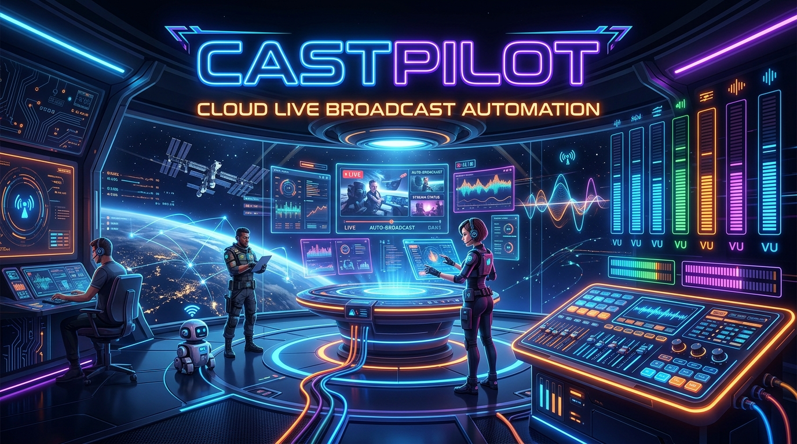
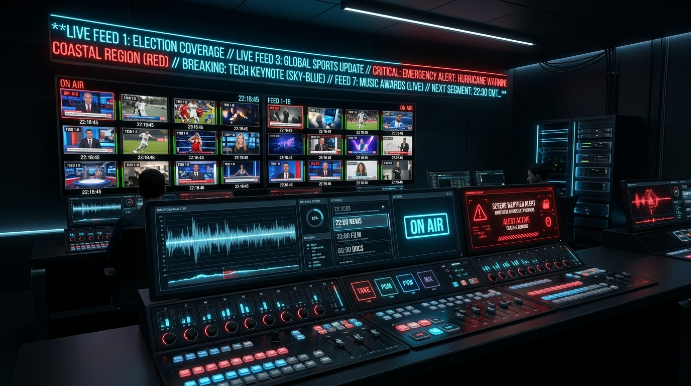

# 🛰️ CASTPILOT // FAST-LIVE BROADCAST SUITE

> **Enterprise-Grade Cloud Playout Automation, High-Precision SCTE-35 Splicing, and Real-Time AI-Powered Audience Engagement.**

<p align="center">
  
</p>

<p align="center">
  
  
  
  
  
</p>

---

## 🌌 ARCHITECTURAL VISION

**CastPilot** is a futuristic, next-generation **FAST (Free Ad-supported Streaming TV)** playout controller and interactive broadcast director designed for modern digital networks. Built to bridge the gap between high-fidelity visual entertainment and real-time community interaction, CastPilot operates as a fully integrated, zero-latency cloud-native studio. 

From automated SCTE-35 programmatic ad-insertion commands to automated playout timelines, real-time Gemini AI metadata enrichment, and transparent OBS Studio graphic overlays, CastPilot empowers small crews to broadcast with the production quality of multi-million dollar traditional TV networks.

---

## 📸 INTERFACE OVERVIEW

<p align="center">
  
  <br />
  <em>Figure 1.0: Next-generation multi-screen playout console featuring live stereo VU metering, emergency override panels, and local program downlinks.</em>
</p>

---

## 🛠️ CORE BROADCAST MODULES

### 1. 📺 Playout Controller & Signal Monitor
* **Dynamic Canvas Animation Engine**: Simulates live playout with custom-crafted animated visual waves that shift color, cadence, and texture based on the currently playing genre (e.g., News corporate grids, Nature emerald landscapes, filler orbit loops).
* **Glitch-Resilient Splicing**: Incorporates simulated CRT signal flickers and transition noise upon program switches to emulate real-world hardware cross-point delays.
* **Segment-Accurate Audio VU Metering**: Features live stereo (L/R) decibel segmentation meters with floating peak indicators, decay timing, and adaptive commercial compression algorithms.

### 2. 🔌 SCTE-35 Programmatic Ad Insertion
* **Downstream Splicing Commands**: Simulates high-precision, industry-standard ANSI/SCTE-35 cue injection (`0xFC` Splice Command payloads) to synchronize with modern ad-servers.
* **Dynamic Ad Breaks**: Triggers programmatic ad breaks with visual and audio metadata alerts, complete with safety recovery countdown sequences.

### 3. 💬 Engagement Studio & Overlay Server
* **OBS Web Browser Source**: Generates an independent, ultra-low-latency, transparent-background graphic overlay URL suitable for inclusion in OBS Studio, vMix, or Wirecast.
* **Live Crawler Ticker**: Real-time, smooth ticker-tape crawler looping dynamic breaking news alerts, sponsor messages, and stream announcements.
* **Dynamic Polling & Analytics**: Deploy instant choice polls with automated voting simulators that render live, animated bar chart analytics directly inside the broadcast monitor and the browser source.
* **Soundboard Event Alerts**: Instantly fire highly stylized follower, subscriber, cheer, and donor alerts.

### 4. 🗄️ Media Asset Management (MAM) & Gemini AI
* **Intelligent Metadata Enrichment**: Leverages **Google Gemini** server-side APIs to automatically analyze program descriptions, generate technical tags, write compliance ratings, and synthesize promotional copy.
* **Asset Library**: High-speed, responsive search, filter, and scheduling drawers for video files, live feeds, and ad filler segments.

### 5. 📅 Timeline Schedule & SCTE Analyzers
* **Conflict Detection Engine**: Analyzes scheduled blocks and alerts programmers of overlap collisions, structural programming gaps, and SCTE marker timing conflicts in real-time.
* **Intelligent Gaps Auto-Filler**: Instant fill algorithms to patch airtime voids with high-yield promotional banners or sponsor spots.
* **Drag-and-Drop Scheduling**: Easily reorder broadcast blocks with standard mouse gestures. Playout timeline start times automatically re-calculate and re-align dynamically to prevent broadcast gaps or overruns.

### 6. 🚨 FCC Emergency Alert System Console
* **Emergency Override Intercept**: Simulates official emergency alerts. Instantly triggers a caution-tape framed warning graphic overlay with scrolling emergency message tape.
* **FCC Dual-Tone Sounders**: Synthesizes standard 853Hz + 960Hz dual-frequency warning oscillators with robotic Text-to-Speech (TTS) synthesized warnings.

### 7. 💵 Programmatic Ad Yield Dashboard
* **Dynamic Yield Localization**: Instantly detects and displays ad yield metrics, forecasted revenues, and average CPM rates scaled to the broadcaster's physical location and local timezone.
* **Multi-Currency Converter**: Support for manual conversion or automatic geolocation detection across USD, EUR, GBP, JPY, AUD, CAD, INR, SGD, CHF, CNY, ZAR, BRL, and AED.

---

## 📡 COGNITIVE PROTOCOLS & DATA FLOW

```
      +--------------------------------------------------+
      |               Gemini Cognitive Core              |
      +------------------------+-------------------------+
                               |
                               v
+------------------+     +-----+-----+     +--------------------+
|  MAM Asset Desk  +---->+ Scheduler +---->+ Playout Controller |
+------------------+     +-----------+     +---------+----------+
                                                     |
                                                     v
+------------------+     +-----------+     +---------+----------+
|  OBS Transparent +<----+ Sync Hub  +<----+  SCTE-35 Ad Inject |
|  HTML5 Overlay   |     +-----+-----+     +--------------------+
+------------------+           ^
                               |
+------------------+           |
| Dual-Monitor Mod +-----------+
| Popout Chat Deck |
+------------------+
```

---

## 🌐 OBS STUDIO & MULTI-SCREEN SETUP

For high-end productions, CastPilot provides decoupled, standalone viewport routes engineered to run outside the primary workspace iframe:

### 🔗 OBS Browser Source Overlay
Add a new **Browser Source** inside your OBS Scene with the following properties:
* **URL**: `http://localhost:3000/?overlay=true` (or your active deployment URL)
* **Width**: `1280`
* **Height**: `720`
* **Custom CSS**: Keep empty (the application serves natively transparent, high-contrast layouts optimized for video chroma-keying).

### 🔗 Dual-Monitor Chat Deck
Launch the popout moderator deck on a secondary touchscreen monitor:
* **URL**: `http://localhost:3000/?popout-chat=true`
* **Features**: Live-updating stream timeline, quick-pin buttons for pinning user messages, timeout buttons for immediate moderation control, and manual chat broadcast injectors.

---

## 🚀 INSTALLATION & DEPLOYMENT

Get your local CastPilot broadcast environment running in less than 2 minutes.

### 📋 Prerequisites
Make sure you have [Node.js](https://nodejs.org/) installed (version 18.0 or higher is highly recommended):
```bash
node --version
# Output should be >= v18.0.0
```

### 📦 Step-by-Step Setup

1. **Clone and Navigate**
   ```bash
   git clone https://github.com/your-username/castpilot.git
   cd castpilot
   ```

2. **Install Workspace Dependencies**
   ```bash
   npm install
   ```

3. **Configure Environment Variables**
   Create a `.env` file in your root folder:
   ```env
   # Google Gemini API key for intelligent metadata analysis
   GEMINI_API_KEY=your_google_gemini_api_key

   # Port configuration (CastPilot defaults to 3000)
   PORT=3000
   ```

4. **Boot Up Development Server**
   Spin up the integrated Express + Vite live development environment:
   ```bash
   npm run dev
   ```
   Open your browser and navigate to `http://localhost:3000` to access the console.

5. **Production Compiling & Running**
   Compile production-ready bundles and boot up the micro-optimized Node server:
   ```bash
   npm run build
   npm run start
   ```

---

## 🛡️ SYSTEM TELEMETRY SPECIFICATIONS
* **Core Playout Rate**: HEVC / H.265 encoded simulating 1080p (60fps) @ 6,200 kbps.
* **Latency Profile**: <120ms internal sync dispatch rate.
* **SCTE Payload Formatting**: Standard SCTE-35 Splice Info Section conforming to ANSI/SCTE 35 2020 specification guidelines.
* **Failover Interval**: Sub-500ms automated Disaster Recovery server redirects.

---

```
[ CASTPILOT BROADCAST SYSTEMS • COGNITIVE MASTER CONTROL ACTIVE ]
```
