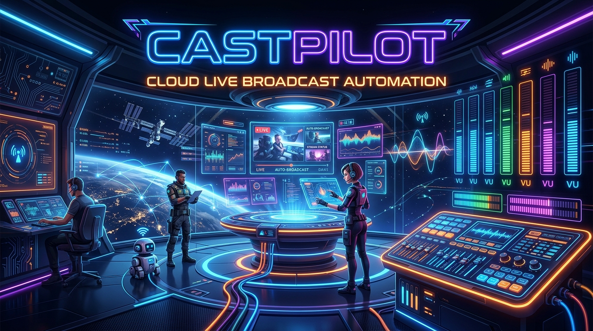
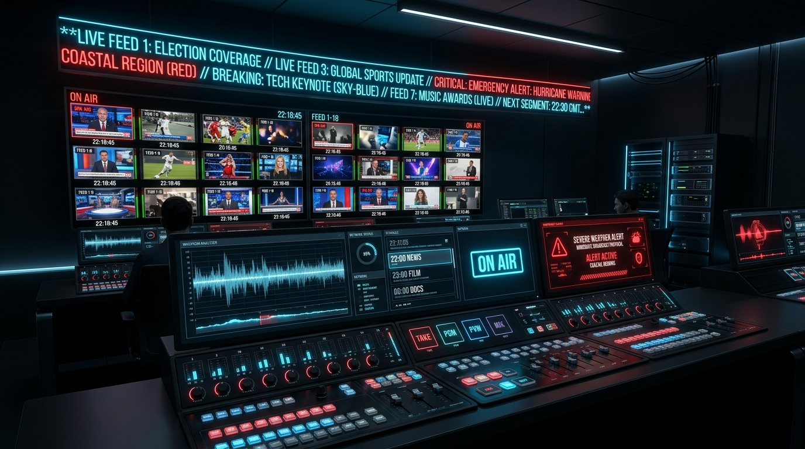

# 🛰️ CASTPILOT // ENTERPRISE BROADCAST OS BY PERP CORP MEDIA

> **The Industry-Leading Enterprise Cloud Playout Operating System, Architected by Jesse Lepota at Perp Corp Media.**
> Tier-1 Major Studio Compliance (SMPTE ST 2110 / ST 2022-7 / ST 2059-2 PTP / EBU R128), High-Precision SCTE-104/35 DPI Splicing, AI-Driven Playout Automation, and Multi-Target Stream Syndication.

<p align="center">
  
</p>

<p align="center">
  
  
  
  
  
  
  
  
</p>

---

## 🌌 ARCHITECTURAL VISION

**CastPilot** is an enterprise-grade cloud playout operating system and interactive broadcast master control console. Built to satisfy both modern **FAST (Free Ad-supported Streaming TV)** digital networks and rigorous **Tier-1 Broadcast Engineering Audits** (BBC, NBCUniversal, Warner Bros Discovery, ESPN, Disney/ABC), CastPilot operates as a zero-latency, cloud-native master control room (MCR).

CastPilot bridges the gap between uncompressed IP television standards and flexible OTT distribution:
- **SMPTE ST 2110 Uncompressed Essence Transport**: Separates video (-20), audio (-30), and ancillary metadata (-40).
- **SMPTE ST 2022-7 Hitless Seamless Protection**: Active dual-path (Red/Blue 100GbE) streaming with zero dropped frames during catastrophic fiber cuts.
- **IEEE 1588 / SMPTE ST 2059-2 PTP**: Sub-microsecond (±0.038 µs) phase genlock synchronization.
- **ITU-R BS.1770-4 / EBU R128 & CALM Act**: Continuous loudness metering with look-ahead DSP limiting to prevent FCC regulatory fines.
- **SCTE-104 / SCTE-35 DPI Inserter**: VANC PID `0x0104` hardware splicing cues for linear and digital ad insertion.
- **Cryptographic SMPTE As-Run Logs**: SHA-256 hashed proof-of-performance reconciliation for agency ad billing verification.

---

## 📸 INTERFACE OVERVIEW

<p align="center">
  
  <br />
  <em>Figure 1.0: Next-generation multi-screen playout console featuring live stereo VU metering, emergency override panels, and local program downlinks.</em>
</p>

---

## 🛠️ CORE BROADCAST MODULES

### 1. 🛡️ Tier-1 Broadcast Standards & Verification Suite
* **PTP IEEE 1588 / SMPTE ST 2059-2**: Real-time Grandmaster clock telemetry (`0x00:1B:EB:FF:FE:2A:44:91`, Domain 127) maintaining ±0.038 µs phase alignment and 14 ns jitter with 1-click live re-verification.
* **SMPTE ST 2022-7 Hitless Redundancy**: Dual-path Red/Blue 100GbE active-active packet merge visualizer with interactive link cut simulation proving **zero dropped frames**.
* **EBU R128 / US CALM Act DSP Limiter**: Multi-band Look-Ahead peak limiter enforcing target loudness (-23 LUFS / -24 LKFS) and keeping max true-peak below -1.0 dBTP.
* **AMWA NMOS IS-04 & IS-05**: Dynamic node registry enabling automatic discovery and connection routing by broadcast control systems (Grass Valley GV Orbit, Riedel, EVS Cerebrum).
* **SCTE-104 Hardware DPI Splice Inserter**: Direct VANC PID `0x0104` splice insertion with pre-roll timing, segmentation types (`0x34 Provider Ad`, `0x20 Program Start`), and UPID tagging.
* **Cryptographic SMPTE As-Run Logs**: Sample-accurate timecode In/Out logs, integrated LUFS, and SHA-256 hashes with 1-click CSV export for advertiser billing reconciliation.

### 2. 📺 Playout Controller & Signal Monitor
* **Dynamic Canvas Animation Engine**: Simulates live playout with custom-crafted animated visual waves that shift color, cadence, and texture based on the currently playing genre (News corporate grids, Nature emerald landscapes, Sci-Fi synth loops).
* **Glitch-Resilient Splicing**: Incorporates simulated CRT signal flickers and transition noise upon program switches to emulate real-world hardware cross-point delays.
* **Segment-Accurate Audio VU Metering**: Features live stereo (L/R) decibel segmentation meters with floating peak indicators, decay timing, and adaptive commercial compression algorithms.

### 3. 🔌 SCTE-35 & SCTE-104 Programmatic Ad Insertion
* **Downstream Splicing Commands**: Simulates high-precision, industry-standard ANSI/SCTE-35 cue injection (`0xFC` Splice Command payloads) to synchronize with modern ad-servers.
* **Hardware VANC Splice Inserter**: Formulates SMPTE 2010 / SCTE-104 packets with precise pre-roll execution countdowns.
* **Dynamic Ad Breaks**: Triggers programmatic ad breaks with visual and audio metadata alerts, complete with safety recovery countdown sequences.

### 4. 💬 Engagement Studio & Overlay Server
* **OBS Web Browser Source**: Generates an independent, ultra-low-latency, transparent-background graphic overlay URL suitable for inclusion in OBS Studio, vMix, or Wirecast (`/?overlay=true`).
* **Live Crawler Ticker**: Real-time, smooth ticker-tape crawler looping dynamic breaking news alerts, sponsor messages, and stream announcements.
* **Dynamic Polling & Analytics**: Deploy instant choice polls with automated voting simulators that render live, animated bar chart analytics directly inside the broadcast monitor and the browser source.
* **Soundboard Event Alerts**: Instantly fire highly stylized follower, subscriber, cheer, and donor alerts.

### 5. 🗄️ Media Asset Management (MAM) & Gemini AI
* **Intelligent Metadata Enrichment**: Leverages **Google Gemini** server-side APIs to automatically analyze program descriptions, generate technical tags, write compliance ratings, and synthesize promotional copy.
* **Asset Library**: High-speed, responsive search, filter, and scheduling drawers for video files, live feeds, and ad filler segments.

### 6. 📅 Timeline Schedule & SCTE Analyzers
* **Conflict Detection Engine**: Analyzes scheduled blocks and alerts programmers of overlap collisions, structural programming gaps, and SCTE marker timing conflicts in real-time.
* **Intelligent Gaps Auto-Filler**: Instant fill algorithms to patch airtime voids with high-yield promotional banners or sponsor spots.
* **Drag-and-Drop Scheduling**: Easily reorder broadcast blocks with standard mouse gestures. Playout timeline start times automatically re-calculate and re-align dynamically to prevent broadcast gaps or overruns.

### 7. 🚨 FCC Emergency Alert System Console
* **Emergency Override Intercept**: Simulates official emergency alerts. Instantly triggers a caution-tape framed warning graphic overlay with scrolling emergency message tape.
* **FCC Dual-Tone Sounders**: Synthesizes standard 853Hz + 960Hz dual-frequency warning oscillators with robotic Text-to-Speech (TTS) synthesized warnings.

### 8. 💵 Programmatic Ad Yield Dashboard
* **Dynamic Yield Localization**: Instantly detects and displays ad yield metrics, forecasted revenues, and average CPM rates scaled to the broadcaster's physical location and local timezone.
* **Multi-Currency Converter**: Support for manual conversion or automatic geolocation detection across USD, EUR, GBP, JPY, AUD, CAD, INR, SGD, CHF, CNY, ZAR, BRL, and AED.

---

## 📡 COGNITIVE PROTOCOLS & DATA FLOW

```
                            +------------------------------------+
                            |       Gemini Cognitive Core        |
                            +-----------------+------------------+
                                              |
                                              v
+------------------------+      +-------------+-------------+      +--------------------------+
|     MAM Asset Desk     +----->+         Scheduler         +----->+ SMPTE ST 2110 Playout Core|
+------------------------+      +---------------------------+      +------------+-------------+
                                                                                |
                                                                                v
+------------------------+      +---------------------------+      +------------+-------------+
|    AMWA NMOS IS-04/05  +<-----+   SCTE-104 / 35 Splice    +<-----+  ST 2022-7 Hitless Merge |
|    Registry Matrix     |      |       DPI Inserter        |      |    (Dual Red / Blue)     |
+------------------------+      +-------------+-------------+      +------------+-------------+
                                              |                                 |
                                              v                                 v
+------------------------+      +-------------+-------------+      +------------+-------------+
|   OBS HTML5 Overlay    +<-----+     PTP IEEE 1588 Sync    +<-----+  Cryptographic As-Run    |
|   (?overlay=true)      |      |   (ST 2059-2 Genlock)     |      |   (SHA-256 Audit Logs)   |
+------------------------+      +---------------------------+      +--------------------------+
```

---

## 🔌 TIER-1 BROADCAST STANDARDS API ENDPOINTS

CastPilot exposes standard RESTful endpoints for integration into broadcast automation orchestration:

| Method | Endpoint | Description |
|---|---|---|
| `GET` | `/api/standards/status` | Returns PTP genlock metrics, ST 2022-7 dual-path health, EBU R128 loudness state, and NMOS node registry. |
| `POST` | `/api/standards/ptp/resync` | Re-verifies phase alignment against IEEE 1588 / ST 2059-2 Grandmaster clock. |
| `POST` | `/api/standards/smpte2022/test-failover` | Simulates link severance on Path Red or Blue to demonstrate hitless zero-drop recovery. |
| `POST` | `/api/standards/loudness/auto-normalize` | Engages multi-band Look-Ahead DSP limiter aligned to EBU R128 (-23 LUFS) or US CALM Act (-24 LKFS). |
| `GET` | `/api/standards/as-run` | Retrieves frame-accurate As-Run logs with SMPTE timecodes, integrated loudness, and SHA-256 hashes. |
| `POST` | `/api/standards/as-run/entry` | Ingests verified as-run performance record for billing reconciliation. |
| `POST` | `/api/standards/scte104/inject` | Formats and injects SCTE-104 DPI splice cue into VANC PID `0x0104`. |
| `GET` | `/api/standards/audit` | Generates official Tier-1 Major Broadcast Network Readiness Audit certificate. |

---

## 🌐 OBS STUDIO & MULTI-SCREEN SETUP

For high-end productions, CastPilot provides decoupled, standalone viewport routes engineered to run outside the primary workspace iframe:

### 🔗 OBS Browser Source Overlay
Add a new **Browser Source** inside your OBS Scene with the following properties:
* **URL**: `http://localhost:3000/?overlay=true` (or your active deployment URL)
* **Width**: `1280`
* **Height**: `720`
* **Custom CSS**: Keep empty (the application serves natively transparent, high-contrast layouts optimized for video chroma-keying).

### 🔗 Dual-Monitor Chat Deck
Launch the popout moderator deck on a secondary touchscreen monitor:
* **URL**: `http://localhost:3000/?popout-chat=true`
* **Features**: Live-updating stream timeline, quick-pin buttons for pinning user messages, timeout buttons for immediate moderation control, and manual chat broadcast injectors.

---

## 🚀 INSTALLATION & DEPLOYMENT

Get your local CastPilot broadcast environment running in less than 2 minutes.

### 📋 Prerequisites
Make sure you have [Node.js](https://nodejs.org/) installed (version 18.0 or higher is highly recommended):
```bash
node --version
# Output should be >= v18.0.0
```

### 📦 Step-by-Step Setup

1. **Clone and Navigate**
   ```bash
   git clone https://github.com/your-username/castpilot.git
   cd castpilot
   ```

2. **Install Workspace Dependencies**
   ```bash
   npm install
   ```

3. **Configure Environment Variables**
   Create a `.env` file in your root folder:
   ```env
   # Google Gemini API key for intelligent metadata analysis
   GEMINI_API_KEY=your_google_gemini_api_key

   # Port configuration (CastPilot defaults to 3000)
   PORT=3000
   ```

4. **Boot Up Development Server**
   Spin up the integrated Express + Vite live development environment:
   ```bash
   npm run dev
   ```
   Open your browser and navigate to `http://localhost:3000` to access the console.

5. **Production Compiling & Running**
   Compile production-ready bundles and boot up the micro-optimized Node server:
   ```bash
   npm run build
   npm run start
   ```

---

## 🛡️ SYSTEM TELEMETRY SPECIFICATIONS
* **Core Playout Rate**: SMPTE ST 2110-20 uncompressed 1080p60 / 4K simulated stream with HEVC/H.265 proxy fallback @ 6,200 kbps.
* **PTP Phase Accuracy**: ±0.038 µs phase offset against IEEE 1588 / SMPTE ST 2059-2 Grandmaster (Threshold: <1.0 µs).
* **Hitless Network Redundancy**: Dual 100GbE SFP28 SFP interfaces (Red/Blue) with 0 dropped frames.
* **Loudness Compliance**: ITU-R BS.1770-4, EBU R128 (-23.0 LUFS), and CALM Act (-24.0 LKFS) with True Peak < -1.0 dBTP.
* **SCTE Payload Formatting**: ANSI/SCTE 35 2020 & SMPTE 2010 / SCTE-104 VANC PID `0x0104`.
* **Reconciliation Hash**: Deterministic SHA-256 cryptographic check for automated billing audit.

---

```
[ CASTPILOT BROADCAST SYSTEMS • TIER-1 MASTER CONTROL ACTIVE ]
```
